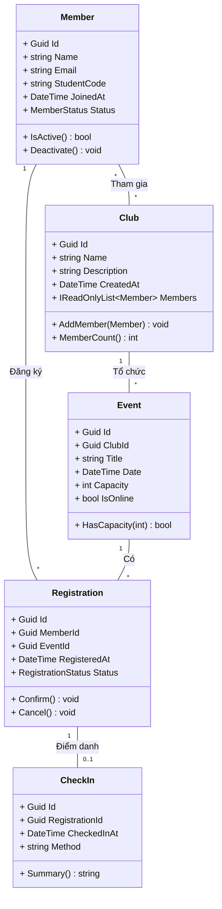

# Sơ đồ lớp Eduhub

```mermaid
classDiagram
    class Member{
        + Guid Id
        + string Name
        + string Email
        + string StudentCode
        + DateTime JoinedAt
        + MemberStatus Status
        + IsActive() bool
        + Deactivate() void
    }
    class Club{
        + Guid Id
        + string Name
        + string Description
        + DateTime CreatedAt
        + IReadOnlyList~Member~ Members
        + AddMember(Member) void
        + MemberCount() int
    }
    class Event{
        + Guid Id
        + Guid ClubId
        + string Title
        + DateTime Date
        + int Capacity
        + bool IsOnline
        + HasCapacity(int) bool
    }
    class Registration{
        + Guid Id
        + Guid MemberId
        + Guid EventId
        + DateTime RegisteredAt
        + RegistrationStatus Status
        + Confirm() void
        + Cancel() void
    }
    class CheckIn{
        + Guid Id
        + Guid RegistrationId
        + DateTime CheckedInAt
        + string Method
        + Summary() string
    }
    Member "*" -- "*" Club : Tham gia
    Member "1" -- "*" Registration : Đăng ký
    Club "1" -- "*" Event : Tổ chức
    Event "1" -- "*" Registration : Có
    Registration "1" -- "0..1" CheckIn : Điểm danh
```

# Khóa ngoại

- `Event.ClubId` -> `Club.Id`
- `Registration.MemberId` -> `Member.Id`
- `Registration.EventId` -> `Event.Id`
- `CheckIn.Registration` -> `Registration.Id`